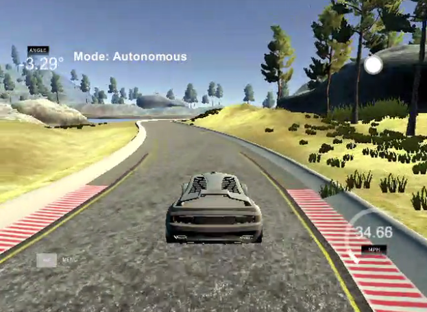

# CarND-Controls-PID
Self-Driving Car Engineer Nanodegree Program



## Dependencies

* cmake >= 3.5
 * All OSes: [click here for installation instructions](https://cmake.org/install/)
* make >= 4.1(mac, linux), 3.81(Windows)
  * Linux: make is installed by default on most Linux distros
  * Mac: [install Xcode command line tools to get make](https://developer.apple.com/xcode/features/)
  * Windows: [Click here for installation instructions](http://gnuwin32.sourceforge.net/packages/make.htm)
* gcc/g++ >= 5.4
  * Linux: gcc / g++ is installed by default on most Linux distros
  * Mac: same deal as make - [install Xcode command line tools]((https://developer.apple.com/xcode/features/)
  * Windows: recommend using [MinGW](http://www.mingw.org/)
* [uWebSockets](https://github.com/uWebSockets/uWebSockets)
  * Run either `./install-mac.sh` or `./install-ubuntu.sh`.
  * If you install from source, checkout to commit `e94b6e1`, i.e.
    ```
    git clone https://github.com/uWebSockets/uWebSockets 
    cd uWebSockets
    git checkout e94b6e1
    ```
    Some function signatures have changed in v0.14.x. See [this PR](https://github.com/udacity/CarND-MPC-Project/pull/3) for more details.
* Simulator. You can download these from the [project intro page](https://github.com/udacity/self-driving-car-sim/releases) in the classroom.

There's an experimental patch for windows in this [PR](https://github.com/udacity/CarND-PID-Control-Project/pull/3)

## Basic Build Instructions

1. Clone this repo.
2. Make a build directory: `mkdir build && cd build`
3. Compile: `cmake .. && make`
4. Run it: `./pid`. 


## Write Up

### PID Controller

The [PID controller](https://en.wikipedia.org/wiki/PID_controller) consists of three terms:Proportional,Integral and Derivative.The proportional,integral,and derivative terms are summed to calculate the output of the PID controller.Defining u as the controller output,the digital implementation of the PID algorithm is  

u = Kp * cte_t + Ki * cte_sum + Kd * cte_diff ,

where 

* Kp is the proportional gain
* Ki is the integral gain
* Kd is the derivative gain
* cte_t is the current cross track error
* cte_sum is the sum of the cte over time
* cte_diff is the current cte - previous cte
 

**Proportional term**  is proportional to the current value of the cte.A high proportional gain results in a large change in the output for a given change in the error.A small gain results in a small output response to a large input error,and a less responsive or less sensitive controller.

**Integral term** is the sum of the instantaneous error over time and gives the accumulated offset that should have been corrected previously.

**Derivative term** is a best estimate of the future trend of the cte,based on its current rate of change.Derivative action predicts system behavior and thus improves settling time and stability of the system.

### Tuning PID parameter


#### Effects of Proportional,Integral and Derivative Action

* Kp :Increasing the value of Kp,the response speed of the system is increased.If Kp is too large,the system is easy to overshoot and unstable.Reducing the value of Kp,the response speed of the system is slow.

* Ki :Integral term can eliminate the steady-state error.The larger the Kp value,the greater the integral effect.Kp value is too large,the system is easy to be unstable.

* Kd :Derivative term can reduce overshoot,overcome oscillation and improve system stability.The larger the value of Kd,the stronger the derivative action._Note:_ Derivative term can't be used alone,must be used together with P or PI,and can not eliminate the steady-state error,but only respond to the rate of change of the cte,regardless of the magnitude fo the cte.

<center>Effets of increasing a parameter independently </center>

Parameter | Rise time | Overshoot | Settling time | Steady-state error | Stability |
|:---:|:---:|:---:|:---:|:---:|:---:|
Kp | Decrease|Increase | Small change | Decrease |Degrade
Ki | Decrease|Increase | Increase | Eliminate | Degrade
Kd | Minor change|Derease | Decrease | No effect in theory|Improve if Kd small

#### Manual tuning
    
 First,set the values of Ki and Kd to zero and increase the value of Kp until the system overshoots.Then increase Kd,until the loop is acceptably quick to reach its reference after a load disturbance.Finally,increase Ki,until any offset is corrected in sufficient time for the process.


#### Twiddle tuning

In the twiddle algorithm,adjust one parameter at a time,until you find an optimal combination of parameters.The steps fo the twiddle algorithm are as follows:

* Build a parameter vector of 3-target parameters (p)and a vector (dp) of potential changes that you want to porbe.Initialize the p and dp.

* Try to increase p by our probing value, and compute a new error for this new modified p.

* If this new error is better than the best error, then set  the best error to this new error and modify the dp to a slightly larger value by multiplying it with 1.1.Otherwise,subtract twice dp from p,then compute the new error.Repeat this step.

* If both of above step fail,set p back to the original value,and decrease the probing value by multiplying it with 0.9.Then,Repeat the above two steps.

* Go through the parameter vector (PID parameters) and repeat the above steps,until the sum of the dp's is larger than the threshold.

The core of Twiddle is that it slightly modifies the PID parameters by the value of dp.If it finds a better solution,it retains it,and it even increments the probing interal.If it fails to find a better solution,it goes back to the original and decreases the probing interal.

### Summary

In summary,when I tuned the PID parameters,I combined the manual tuning and twiddle tuning.First,I found the appropriate Kp by manual tuning,then fine tuned Kp by twiddle.Second,I added the derivative term and initialize its value,then found a suitable PD parameters through twiddle.Finally,I added the integral term and found the optimal PID parameters through twiddle.


